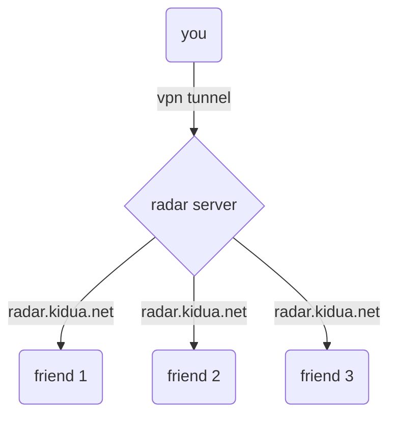

# radar

this projects aims to provide a better way to share the kiduahook radar data with your friends.

## how it works

## transparency

the client and server are open source and can be reviewed in this repository.

## advantages over traditional radar sharing

- no ip sharing
- no need to port forward
- session based access

## prerequisites

- active kiduahook cs2 subscription
- valid api token (you can get one by contacting me on discord)

the client was only tested on windows 11, but it should work on windows 10 as well.

## how to use

- download the latest client release from the [releases page](https://github.com/radartechnology/radar/releases/latest)
- run the game and start the cheat
- run the clientgit branch -M main
- enter your api token
- press enter
- the client will automatically detect the game and connect to the radar server
- send the url shown in the client window to your friends
- enjoy the radar

## faq

- **q:** which data is being saved on my device?
    - the client caches the entered api token in Documents\token.txt

- **q:** which data is shared with the radar server?
    - the client reads the data from the cheat
      using [windows ipc](https://learn.microsoft.com/en-us/windows/win32/ipc/pipes)
    - the client then streams the player data to the radar server
      using [websockets](https://developer.mozilla.org/en-US/docs/Web/API/WebSockets_API)
    - additionally, the client sends the entered api token to the radar server to authenticate the user

- **q:** which data is being stored on the radar server?
    - session data is stored in memory until you close the client and is not persisted to disk. session data contains:
        - connected websocket clients (your friends via the website and you as the data provider)
    - api tokens are persisted to the disk in an encrypted form
    - logs containing anonymous data are persisted to the disk for debugging purposes
    - no ip addresses are stored
    - no player data is stored

- **q:** which data can my friends see?
    - your friends can only see the player data you are sending to the radar server and the session id
    - your friends can not see your api token
    - your friends can not see your ip address
